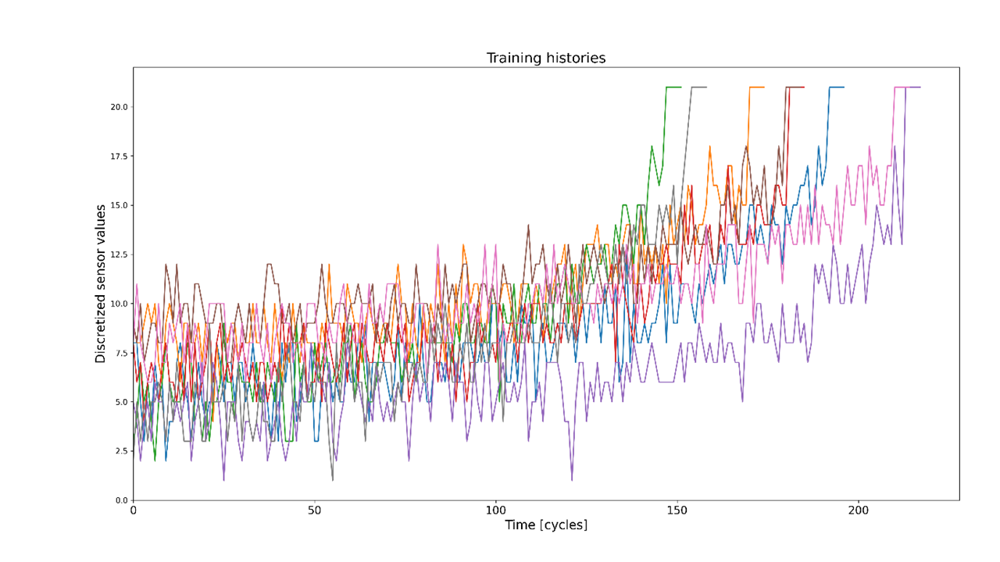
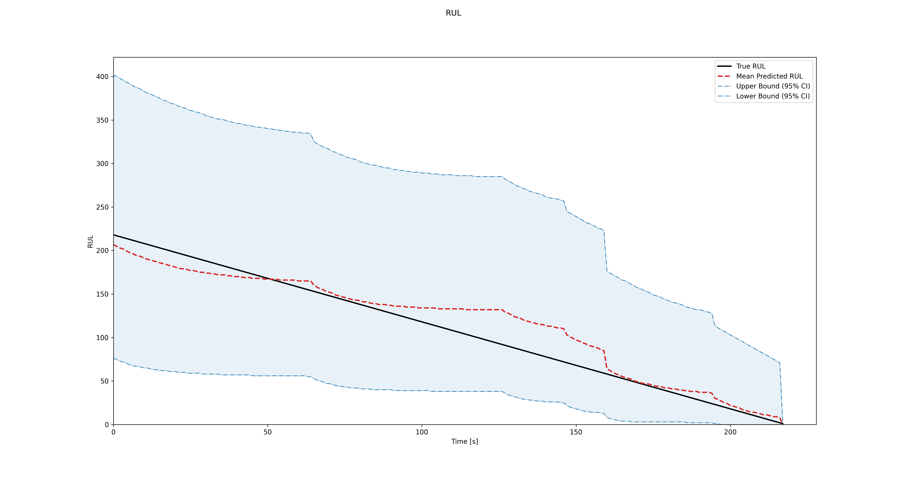
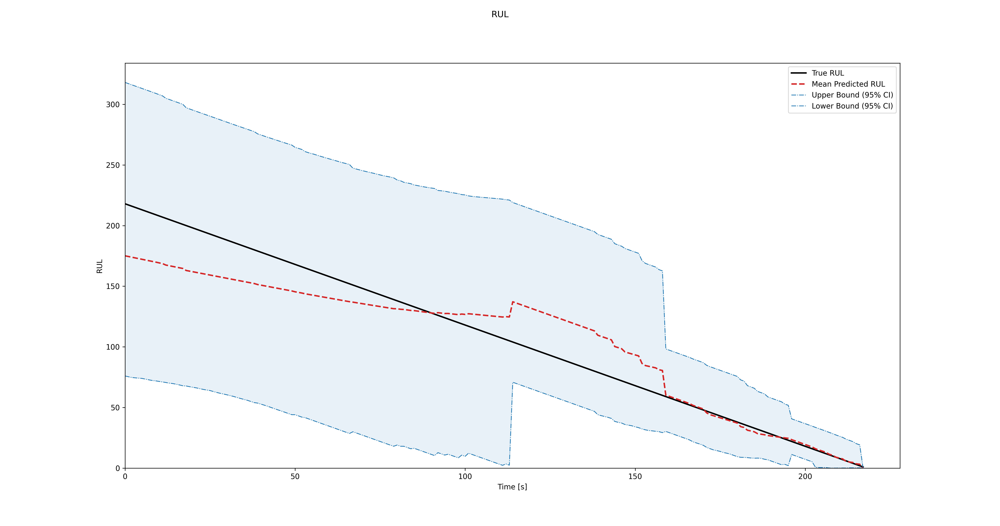

Quick Start Guide: Prognostics using C-MAPSS
*********************************************

This guide provides a step-by-step process for loading the C-MAPSS dataset, creating a Hidden Markov Model (HMM) and a Hidden Semi-Markov Model (HSMM), and performing prognostics using your model.

.. warning::
    This example will NOT run with the PyPi install, since the package does not 
    contain the example data. To get all of the required files, please build
    the entire GitHub repository, following the respective instructions.
        

.. contents:: Table of Contents
   :depth: 3
   :local:

Using the classic Hidden Markov Model (HMM) for prognostics
===========================================================

Step 1: Load the C-MAPSS data example
-------------------------------------

The C-MAPSS (Commercial Modular Aero-Propulsion System Simulation) dataset is a widely used benchmark in Prognostics and Health Management (PHM), providing simulated degradation data for aircraft turbofan engines operating under various conditions. It contains multivariate time-series measurements from multiple sensors collected over the entire operational life of each engine, from healthy operation to system failure. 

The FD001 sub-dataset represents a single operating condition with a single fault mode, making it well suited for developing and evaluating data-driven approaches to degradation modeling and remaining useful life estimation. The C-MAPSS dataset also includes additional sub-datasets: FD002, with six operating conditions and one fault mode; FD003, with one operating condition and two fault modes; and FD004, with six operating conditions and two fault modes. 

For the purposes of the example case study, only data from sensor 11 of the FD001 sub-dataset is considered. This sensor data is discretized into 20 values to facilitate its use with Hidden Markov Models (HMMs). Each run-to-failure degradation history corresponds to the time-series data collected from a single engine, starting from healthy operation and ending at system failure. The training dataset consists of 80 such degradation histories, while the testing dataset contains 20 degradation histories

The dataset includes two files:

- ``train_FD001_disc_20_mod.csv`` for training
- ``test_FD001_disc_20_mod.csv`` for testing

First, ensure you have the necessary imports:

.. code-block:: python

   import himap
   from utils import *
   from himap.base import HMM, GaussianHSMM

To load the data, use the following Python code:

.. code-block:: python

   f_value = 21  # Failure value
   obs_state_len = 5  # Number of times the failure value is repeated in the data

   # Load training and testing data
   seqs_train, seqs_test = load_data_cmapss(f_value=f_value, obs_state_len=obs_state_len)

The ``f_value`` refers to the failure value (21), and ``obs_state_len`` indicates how many times this failure value is repeated in the training data. This ensures that the model learns a consistent failure pattern. To better understand the degradation process, visualize a few degradation histories from the training set. Below, you can see 8 example trajectories, showing how sensor readings change over time. Since this dataset comes from one failure mode (FD001), the degradation trends in training and testing are similar.  

Step 2: Create Your HMM
-----------------------

Next, define the Hidden Markov Model (HMM). The number of observation symbols is 21 due to the discretization of the data (20 values plus the failure value). The number of states can be adjusted depending on your preference.

.. code-block:: python

   hmm_c = HMM(n_obs_symbols=f_value)

You can also provide ``n_iter`` as an input, which specifies the maximum number of iterations for training the model.

Step 3: Optimize the Number of States and Train Your Model
----------------------------------------------------------

To determine the optimal number of states, you can use the Bayesian Information Criterion (BIC), which balances model complexity and fit:

.. code-block:: python

   hmm_c, bic = hmm_c.fit_bic(seqs_train, states=list(np.arange(2, 15)))

This tests models with 2 to 15 states (you can adjust the range) and returns the best one based on BIC.

If you already know the number of hidden states that you want to use, you can define them during the instantiation of the model with the ``n_states`` parameter and train your model directly:

.. code-block:: python
   
   hmm_c = HMM(n_states=5, n_obs_symbols=f_value)
   hmm_c.fit(seqs_train)

Step 4: Perform Prognostics
---------------------------

Once the model is trained, you can use the defined prognostic module to predict the Remaining Useful Life (RUL):

.. code-block:: python

   hmm_c.prognostics(seqs_test, plot_rul=True, get_metrics=True)

This function will generate and save RUL plots in a ``figures`` folder, each figure corresponds to the RUL predictions of each test tracjectory. Also, the function saves a CSV file containing the following performance metrics:

- **RMSE**: Measures prediction accuracy (lower is better)
- **Coverage**: Indicates how well the true RUL values fall within the confidence intervals (ideal = 1)
- **WSU**: Represents the spread of uncertainty (higher values indicate wider confidence intervals)

Additionally, RUL probability distributions (PDFs) for each time step are saved in the ``dictionary`` folder, along with confidence intervals.

Below there is an example of the RUL prediction results. The x-axis corresponds to the operational time and the y-axis to the RUL (which has the same units as the operational time). The true RUL is defined as the time remaining before failure, computed using the known failure time of the system and decreasing linearly as the system operates. The predicted RUL represents the model’s estimate of this remaining lifetime based on the observed sensor data. The confidence intervals indicate the uncertainty associated with the prediction, providing a range of plausible RUL values around the estimate, with wider intervals reflecting higher uncertainty.

Using a More Advanced Model: HSMM
=================================

The C-MAPSS data might be too complex for an HMM. To improve predictions, we can use a Hidden Semi-Markov Model (HSMM).

Step 1: Create Your HSMM
------------------------

An HSMM works similarly to an HMM, but states last for varying durations instead of transitioning at each step. Unlike HMMs, HSMMs don’t need predefined observation symbols. However, they require ``n_durations``, which is the maximum duration each state can have.

.. code-block:: python

   hsmm_c = GaussianHSMM(n_durations=200, f_value=f_value, obs_state_len=obs_state_len)

Step 2: Optimize the Number of States and Train Your Model
----------------------------------------------------------

Similar to the HMM, you can use the ``fit_bic`` method to optimize the number of states using the BIC criterion.

.. code-block:: python

   hsmm_c.fit_bic(seqs_train, states=list(np.arange(2, 7)))

Step 3: Perform Prognostics
---------------------------

With the trained HSMM, perform prognostics:

.. code-block:: python

   hsmm_c.prognostics(seqs_test, plot_rul=True, get_metrics=True)

By using HSMMs, you’ll likely see improved RUL predictions compared to HMMs! For the C-MAPSS, the RMSE improves, and the uncertainty confidence intervals reduce over time. 

How to load your own dataset
===========================================================

If you want to use your own dataset with HiMAP for prognostics, you can do so using the auxiliary function `create_data_hsmm()` provided in `utils.py`. This function prepares your data in the correct format for training and testing HMM or HSMM models.

Step 1: Prepare your data files
-------------------------------

Each run-to-failure trajectory must be stored in a separate CSV file.
Every CSV file should contain a column named clusters, which represents discrete condition monitoring data (or cluster labels) sampled at a consistent rate.

For example, a single CSV file might look like:

.. code-block:: csv

   clusters
   1
   1
   2
   2
   3
   ...
   21

Step 2: Understand how the data is processed
---------------------------------------------

The `create_data_hsmm()` function takes a list of CSV file paths as input. For each file, it:

1. Reads the clusters column

2. Stores each trajectory as a list of observed states in a dictionary

To standardize the end-of-life behavior across trajectories:

* A predefined failure value (f_value) is appended to the end of each trajectory

* This failure value is repeated obs_state_len times to help the model learn the failure pattern more effectively

In addition, the function handles indexing automatically:

* If your data is zero-indexed (states start at 0), cluster labels are shifted by +1 internally to ensure compatibility with HMM and HSMM implmentations.

* This behavior is enabled by default (is_zero_indexed = True)

* If your data is already one-indexed, this adjustment can be disabled by `is_zero_indexed = False`

Step 3: Load your training and testing data
-------------------------------------------

First, collect all CSV files for training and testing into separate folders. Then, create a list of file paths and pass them to `create_data_hsmm()`.

.. code-block:: python

   from utils import create_data_hsmm
   import os

   # Define parameters
   f_value = 21        # Failure value appended at the end of each trajectory
   obs_state_len = 5   # Number of times the failure value is repeated

   train_folder = 'path/to/your/train/folder'
   test_folder = 'path/to/your/test/folder'

   # Read all CSV files in the train and test folders
   train_files = [
      os.path.join(train_folder, f)
      for f in os.listdir(train_folder)
      if f.endswith('.csv')
   ]

   test_files = [
      os.path.join(test_folder, f)
      for f in os.listdir(test_folder)
      if f.endswith('.csv')
   ]

   # Create training and testing trajectories
   seqs_train = create_data_hsmm(train_files, f_value, obs_state_len)
   seqs_test = create_data_hsmm(test_files, f_value, obs_state_len)

The resulting `seqs_train` and `seqs_test` objects are dictionaries containing run-to-failure trajectories in a format directly compatible with HiMAP’s HMM and HSMM models.

You can now use these datasets for model training and prognostic evaluation as demonstrated in the previous sections.