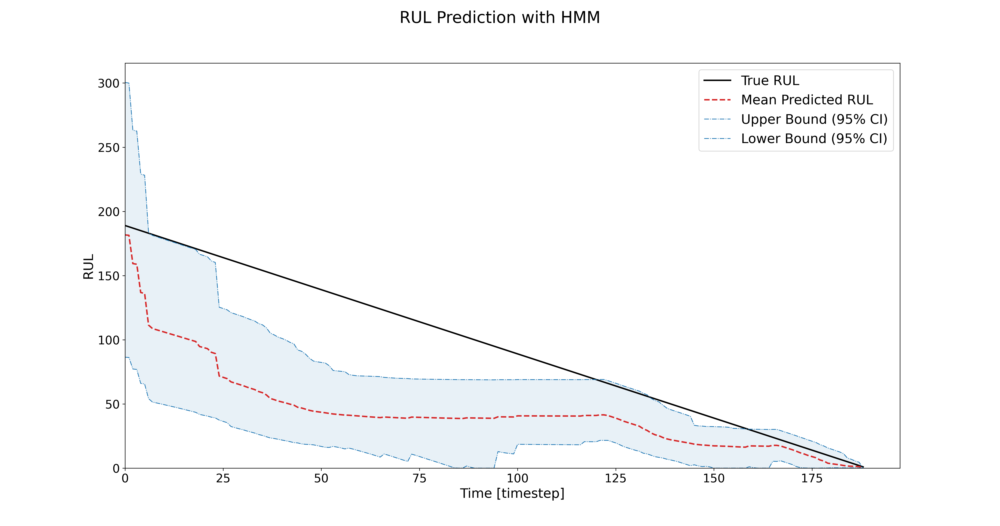
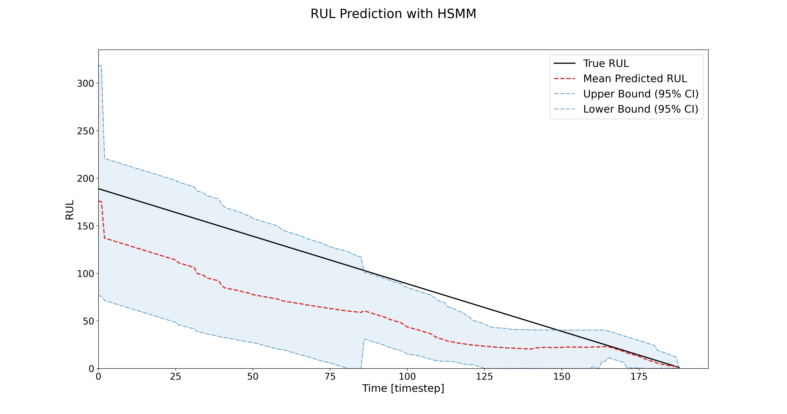

# Summary
Prognostics, the science of predicting systems' future health, performance, and remaining useful life (RUL), is critical across various fields, including aerospace, energy, manufacturing, and transportation. These industries require advanced tools to model complex and often hidden degradation processes under real-world conditions, where physical models are unavailable or incomplete. Hidden Markov Models (HMMs) and Hidden Semi-Markov Models (HSMMs) effectively address these challenges by providing an unsupervised stochastic framework capable of modeling a system's degradation process without relying on labeled data. By probabilistically representing transitions between hidden states over time, these models effectively capture the stochastic nature of degradation, making them particularly well-suited to handle the complexities of prognostics tasks.

# Statement of need

Modern systems in critical industries, such as aerospace and energy, are often used under different operational conditions, with limited or no labeled data available for training. These systems frequently lack comprehensive physical models to accurately describe degradation processes, making it challenging to predict future failures [@guo2019review]. Therefore, advanced prognostics, which are defined here as providing reliable RUL predictions under such conditions, are essential for optimizing maintenance schedules, reducing downtime, and improving system reliability. For example, in aerospace, advanced prognostics assist in predicting component failures in aircraft, thereby reducing in-flight risks and preventing costly delays [@prognostics2023aircraft]. In the energy sector, these methods enable the continuous monitoring of wind turbines [@LEITE20181917] and battery health [@hu2020battery], optimizing efficiency and extending operational lifespans.

While state-of-the-art Deep Learning (DL) models, such as Long Short-Term Memory (LSTM) networks and Convolutional Neural Networks (CNNs), have shown results with high accuracy, they require large labeled datasets, are sensitive to environmental uncertainties, and struggle to generalize when operational conditions deviate from training scenarios [@vollert2021challenges], [@da2020remaining], [@li2020data].

Stochastic models like HMMs [@rabiner] and HSMMs [@yu] offer a robust alternative for advanced prognostics. By treating RUL as a random variable, these models inherently address the uncertainties in degradation processes and adapt to changes in operational conditions. Their probabilistic foundation makes them particularly suited for real-world applications where labeled failure data is sparse or unavailable. Moreover, their ability to model the stochastic nature of degradation processes ensures reliable predictions, even under varying and unpredictable conditions.

HiMAP is a repository that implements HMMs and HSMMs specifically designed for prognostics applications. To the best of the authors’ knowledge, it is the first package to provide such models explicitly tailored to prognostics rather than to generic time-series analysis. For example, the packages `hmmlearn` and `hmms` implement continuous and discrete HMMs that can be used for a wide variety of applications, but they are not targeted to a specific discipline. As a result, they do not include the assumptions typically required for prognostics, and it is left to the user to determine how to use the estimated hidden states to compute the RUL. In a similar way, the package `PyMC` offers a wide and well-documented variety of stochastic and Bayesian models that can be applied to time-series analysis and survival analysis (a discipline closely related to prognostics), but none of these models are specifically designed for the prognostic task.

In HiMAP, each model is implemented as a dedicated Python class, designed for seamless integration into diverse workflows. These classes provide essential methods such as `decode`, for inferring the most likely sequence of hidden states; `fit`, for parameter learning; `bic_fit`, for jointly selecting the optimal number of hidden states and estimating model parameters; and `sample`, for generating synthetic sequences. Beyond these core functionalities, the repository introduces advanced features for calculating RUL using a novel prognostic measure [@phme_conference]. This measure can be easily implemented by the user through the prognostics method and only requires the test dataset as input. By leveraging Viterbi-decoded state sequences [@rabiner], it produces a probability density function (pdf) of the RUL, enabling reliable and uncertainty-aware predictions. These RUL predictions are illustrated in the images below, which correspond to the same example trajectory but highlight the differences in results obtained with each model. Although the HMM can be trained more quickly, its predictions are less optimal than those of the HSMM, which, as shown in the figures, yields narrower confidence intervals at the expense of a higher computational cost.

{ width=45% } { width=45% }

# References

